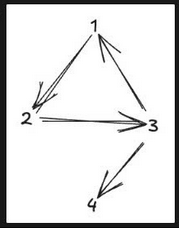

# Simple Network Rank

Company: NAB

## Description

Return the max number of roads of connected nodes in a network (including isolated nodes).

Given:
* N — number of nodes
* A, B — edges from node A[i] to node B[i]

Examples:

```plaintext
N = 6  
A = [1, 2, 4, 5]  
B = [2, 3, 5, 6]  
// Answer: 2
```


```plaintext
N = 4  
A = [1, 2, 3, 3]  
B = [2, 3, 1, 4]  
// Answer: 4
```
